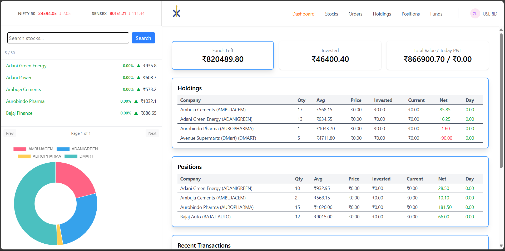
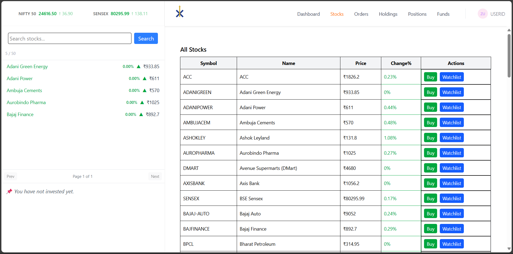

# InvestraX

[](https://github.com/SG-07/InvestraX)
[](https://investrax-api.onrender.com)
[](LICENSE)
[](https://www.mongodb.com/)

---

## Overview

**InvestraX** is a full-stack stock market simulator that allows users to track portfolios, monitor stocks, and manage watchlists with real-time data fetched from a CSV/Google Sheet backend. It’s built using React (frontend/dashboard) and Node.js + Express (backend) with MongoDB Atlas as the database.

⚠️ **Disclaimer:** Data comes from **Google Finance** and may have a delay of up to **20 minutes**. This project is built for **learning & simulation purposes only**, not for actual trading.

### Users can:
- View a dashboard of stock performance
- Track their portfolio and see profit/loss percentages
- Buy stocks (simulation)
- Add stocks to a watchlist
- See market indices like NIFTY and SENSEX

---

## Screenshots

### Dashboard


### Stocks Page


---

## Features

- **Portfolio Tracking:** Displays invested value, total value, and today’s profit/loss.  
- **Stock Holdings & Positions:** Track long-term (CNC) and intraday (NRML) trades.  
- **Watchlist Management:** Add/remove stocks from your personal watchlist.  
- **Market Data Fetch:** Fetches NIFTY and SENSEX indices along with all individual stock prices.  
- **Interactive UI:** Clean dashboard with tables, charts, and responsive design.  
- **Secure Backend:** JWT authentication, bcrypt password hashing, and Helmet security.
- **Real-time Portfolio Tracking:** Displays current value, profit/loss, and allocations.
- **Responsive UI:** Built with React, TailwindCSS, and Chart.js for interactive charts.

---

## Tech Stack

### Backend
- Node.js + Express
- MongoDB Atlas
- Axios, Bcryptjs, JSON Web Token
- Helmet, CORS, Morgan
- Node-Cron (scheduled tasks)
- CSV / Google Finance integration

### Dashboard & Frontend
- React 19
- Vite
- TailwindCSS
- Chart.js + react-chartjs-2
- React Router DOM
- React Toastify
- Framer Motion (frontend animations)

---

## Tech Stack
### Backend
- Node.js & Express
- MongoDB Atlas
- Axios, Bcryptjs, JSON Web Token, Helmet, CORS, Morgan, Node-Cron
- CSV/Google Sheet data integration

### Dashboard & Frontend
- React 19
- TailwindCSS
- Vite
- Axios
- Chart.js & react-chartjs-2
- React Router DOM
- React Toastify
- Framer Motion (frontend)

## Project Structure
### Backend

```text
backend/
│── config/
│ └── .env
│
│── controllers/
│ ├── authcontroller.js
│ ├── portfoliocontroller.js
│ ├── stockscontroller.js
│ ├── tradecontroller.js
│ ├── usercontroller.js
│
│── init/
│ ├── companies.js
│ ├── init.js
│ ├── migrateStocks.js
│ ├── seedcompaines.js
│ ├── seedindices.js
│
│── middleware/
│ ├── authmiddleware.js
│ └── trimsymbol.js
│
│── Models/
│ ├── portfolioModel.js
│ ├── StocksModel.js
│ ├── UserModel.js
│
│── Routes/
│ ├── AuthRoutes.js
│ ├── PortfolioRoutes.js
│ ├── StocksRoutes.js
│ ├── traderoutes.js
│ └── UserRoutes.js
│
│── Schemas/
│ ├── embeds/
│ │   ├─ holdingembedded.js
│ │   ├─ positionembedded.js
│ │   ├─ transcationembedded.js
│ │   ├─ watchlistembedded.js
│ ├── portfolioschema.js
│ ├── stocksschema.js
│ └── userschema.js
│
│── services/
│ └── updater.js
│
│── tests/
│ └── testSheet.js
│
│── utils/
│ ├── formatStockData.js
│ └── screttoken.js
│
│── views/
│ ├── 404.html
│ └── index.ejs
│
└── index.js
```

### Dashboard

```text
dashboard/
├─ src/
│ ├─ components/
│ │ ├─ BuyActionWindow.jsx
│ │ ├─ Dashboard.jsx
│ │ ├─ DoughnutChart.jsx
│ │ ├─ Funds.jsx
│ │ ├─ GeneralContext.jsx
│ │ ├─ Holdings.jsx
│ │ ├─ Home.jsx
│ │ ├─ Menu.jsx
│ │ ├─ Orders.jsx
│ │ ├─ Position.jsx
│ │ ├─ ProtectedRoute.jsx
│ │ ├─ SellActionWindow.jsx
│ │ ├─ Stocks.jsx
│ │ ├─ Summary.jsx
│ │ ├─ Topbar.jsx
│ │ ├─ VerticalGraph.jsx
│ │ ├─ WatchList.jsx
│ │ └─ WatchlistSearch.jsx
│ │
│ ├─ services/
│ │ └─ api.js # central API calls
│ │
│ ├─ App.jsx # main routes
│ ├─ App.css
│ ├─ main.jsx # React entry point
│ └─ index.css / tailwind.css # styles
│
├─ .env # contains VITE_BACKEND_URL etc.
├─ package.json
└─ vite.config.js
```
### Frontend

```text
frontend/
├─ src/
│  ├─ assets/
│  │   ├─ InvestraX_logo11.svg
│  │   ├─ InvestraX_logo_mockup.png
│  │   └─ logo.svg
│  ├─ components/
│  │   ├─ layout/
│  │   │     ├─ Footer.jsx
│  │   │     ├─ NavBar.jsx
│  │   │     ├─ NotFound.jsx
│  │   │     └─ OpenAccount.jsx 
│  │   └─ ProtectedRoute.jsx
│  ├─ pages/
│  │   ├─ Layout.jsx
│  │   └─ UnderConstruction.jsx
│  ├─ routes/
│  │    ├─ about/
│  │    │     ├─ AboutPage.jsx
│  │    │     ├─ Hero.jsx
│  │    │     └─ Team.jsx
│  │    ├─ home/
│  │    │     ├─ Awards.jsx
│  │    │     ├─ Education.jsx
│  │    │     ├─ Hero.jsx
│  │    │     ├─ HomePage.jsx
│  │    │     ├─ Pricing.jsx
│  │    │     └─ Stats.jsx
│  │    ├─ pricing/
│  │    │     ├─ Brokerage.jsx
│  │    │     ├─ Hero.jsx
│  │    │     └─ PricingPage.jsx
│  │    ├─ products/
│  │    │     ├─ Hero.jsx
│  │    │     ├─ LeftSection.jsx
│  │    │     ├─ ProductPage.jsx
│  │    │     └─ RightSection.jsx
│  │    ├─ signup/
│  │    │     ├─ index.js
│  │    │     ├─ Login.jsx
│  │    │     └─Signup.jsx
│  │    └── support/
│  │          ├─ CreateTicket.jsx
│  │          └─ SupportPage.jsx
│  │
│  ├─ App.jsx                   # main routes (probably guarded by ProtectedRoute)
│  ├─ main.jsx                  # React entry point
│  └─ index.css / tailwind.css  # styles
│
├─ index.html
├─ .env                         # contains VITE_BACKEND_URL etc.
├─ package.json
└─ vite.config.js
```

## Installation
### Backend

```bash
cd backend
npm install
npm run dev
```

### Dashboard

```bash
cd dashboard
npm install
npm run dev
```

### Frontend

```bash
cd frontend
npm install
npm run dev
```

### Note: Ensure you have .env files set up in the backend with your MongoDB URI, ALLOWED_ORIGINS, JWT secret, DASHBOARD_URL, FRONTEND_URL and
SHEET_CSV_URL=https://docs.google.com/spreadsheets/d/e/2PACX-1vT4D3nHz5qZGdKTQIeimp4B2IQTzRu083hG9-yDAMUE2xJgOZ7BHsx4Q0FcZmf8nbq6aTXm4S0gEOOd/pub?gid=0&single=true&output=csv .

## 🌐 API Endpoints
### Auth

- POST /api/auth/signup – Register new user
- POST /api/auth/login – Login
- GET /api/auth/verify – Verify session
- POST /api/auth/logout – Logout

### Portfolio
- GET /api/portfolio/summary – Portfolio summary
- GET /api/portfolio/holdings – User holdings
- GET /api/portfolio/positions – Open positions
- GET /api/portfolio/transactions – Recent transactions
- GET /api/portfolio/orders – Orders history
- GET /api/portfolio/watchlist – Watchlist
- POST /api/portfolio/watchlist – Add to watchlist
- DELETE /api/portfolio/watchlist/:symbol – Remove from watchlist
- GET /api/portfolio/breakdown – Portfolio breakdown for charts
- GET /api/portfolio/sellinfo/:type/:symbol – Info before selling

### Trades
- POST /api/trade/buy – Buy stock
- POST /api/trade/sell – Sell stock
- POST /api/trade/reset – Reset portfolio
- GET /api/trade/wallet – Wallet details

### Stocks
- GET /api/stocks – List all stocks
- GET /api/stocks/:symbol – Get one stock
- GET /api/stocks/categories – Stock categories
- GET /api/stocks/market/sensex – Sensex data
- GET /api/stocks/market/nifty – Nifty data

## Roadmap
- Implement stock sell functionality with tax calculation
- Add charting for stock price history (candlestick charts)
- Enable user-specific dashboards (multi-user)
- Real-time WebSocket updates for stock prices
- Mobile-friendly PWA support

Contributing

## Contributions are welcome!
- Fork the repo
- Create a new feature branch (git checkout -b feature/my-feature)
- Commit your changes (git commit -m 'Add new feature')
- Push to your branch (git push origin feature/my-feature)
- Open a Pull Request

## ⚠️ Note on Data Source
- Stock data is fetched from Google Finance
- ⚠️ May have up to ~20 minutes delay compared to live market prices

### This project is intended for learning & simulation purposes only, not real trading

## 📌 Future Enhancements
- 💾 Persistent trade history with charts
- 🔔 Price alerts for watchlist
- 📉 Advanced technical indicators

## License

 This project is licensed under the MIT License


## 🙌 Acknowledgements
 
- Google Finance for market data feeds (up to 20min delay)
- MongoDB Atlas for database hosting 
- Open-source React/Node ecosystem  

---

## 👤 Author

**Satyam Gangwar**  

[](https://www.linkedin.com/in/satyamgangwar/)
[](mailto:gangwar.satyam01@gmail.com)
